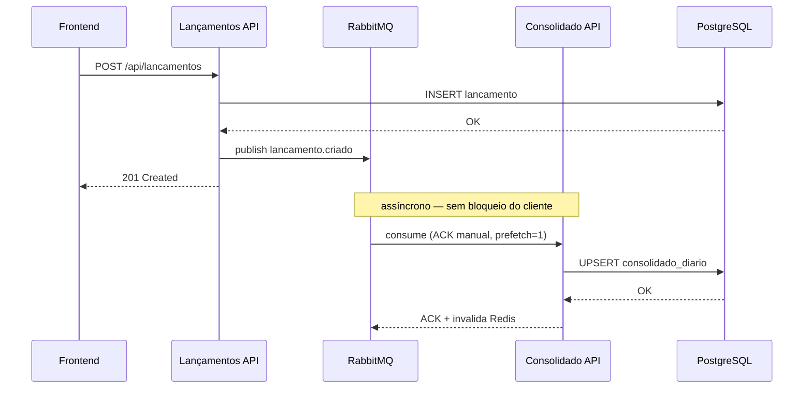
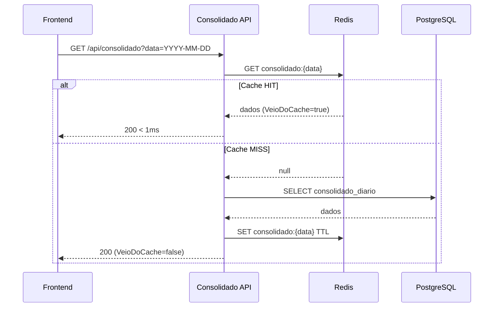
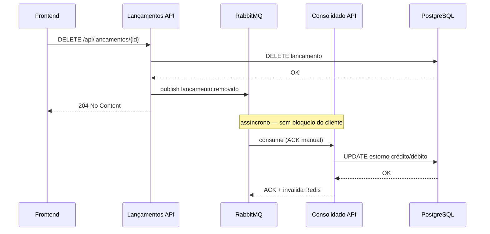

# 💰 FluxoCaixa — Controle de Fluxo de Caixa

Sistema distribuído para controle de lançamentos financeiros e consolidação diária. Desenvolvido como desafio de Arquitetura de Software com foco em **microserviços, comunicação assíncrona e resiliência**.

---

## 🏗️ Arquitetura


---

## 📐 Decisões Arquiteturais

### Por que dois microserviços independentes?

O requisito crítico do desafio é a **independência entre lançamentos e consolidado**. Uma falha no serviço de consolidação não pode impedir o registro de novos lançamentos.

| Critério             | Decisão                                                         |
| -------------------- | --------------------------------------------------------------- |
| Isolamento de falhas | Lançamentos e Consolidado têm ciclos de vida independentes      |
| Escalabilidade       | Cada serviço escala horizontalmente de forma autônoma           |
| Bounded Contexts     | Cada serviço tem seu próprio modelo de domínio e banco          |
| Comunicação          | Assíncrona via RabbitMQ — sem acoplamento direto entre serviços |

### Por que RabbitMQ e não chamada REST direta?

Chamada REST síncrona criaria acoplamento: se o Consolidado estiver fora do ar, o lançamento falharia. Com RabbitMQ, o Lançamentos publica o evento e segue — o Consolidado processa quando disponível. As mensagens ficam enfileiradas e não são perdidas.

> ⚠️ **Decisão documentada no código:** falha no RabbitMQ não reverte o lançamento já persistido. Em produção, aplicar **Outbox Pattern** para garantia total de entrega (ver `docs/adr/ADR-004-outbox-pattern-futuro.md`).

### Por que Redis?

O consolidado diário é consultado com alta frequência no dashboard. O Redis serve como cache L2 com invalidação precisa: ao processar um novo lançamento, apenas a chave da data afetada é invalidada — evitando thundering herd sem abrir mão de consistência.

---

## 🔄 Fluxo de Dados

### Registro de lançamento



### Consulta de consolidado diário



### Remoção de lançamento



---

## 📋 Requisitos Não Funcionais

### ✅ Escalabilidade

- **Cache Redis** com política `allkeys-lru` e limite de 256MB — consultas ao consolidado são absorvidas sem pressionar o banco
- **Containers independentes** — cada serviço escala horizontalmente sem afetar o outro
- **Mensageria assíncrona** — picos de lançamentos são absorvidos pela fila sem degradar o Consolidado

### ✅ Resiliência

- **Isolamento de falhas** — Consolidado fora do ar não impede registro de lançamentos
- **ACK manual no RabbitMQ** — mensagem só é removida da fila após processamento bem-sucedido; em caso de erro, `NACK + requeue` garante retry automático
- **AutomaticRecoveryEnabled** — o consumer do Consolidado reconecta automaticamente se o broker cair
- **Healthchecks** em todos os serviços de infraestrutura com retry no `docker-compose`

### ✅ Disponibilidade

- **Dependências com condição `service_healthy`** no docker-compose — APIs sobem apenas após PostgreSQL, Redis e RabbitMQ estarem prontos
- **Volumes persistentes** — dados não são perdidos em reinicializações
- **Migrations automáticas** no startup das APIs

### ✅ Segurança

- CORS configurado explicitamente por origem
- Usuário não-root nos containers Docker
- Stack trace exposto apenas em `Development`
- Erros HTTP retornam mensagens padronizadas sem vazar internos

---

## 🗂️ Estrutura do Projeto

```
fluxo-caixa/
├── docs/
│   └── adr/                                    # Architecture Decision Records
│       ├── ADR-001-microservicos-assincrono.md
│       ├── ADR-002-banco-de-dados.md
│       ├── ADR-003-cache-redis.md
│       └── ADR-004-outbox-pattern-futuro.md
├── frontend/                                   # Angular 17 standalone
│   ├── src/app/
│   │   ├── core/services/                      # LancamentosService, ConsolidadoService
│   │   └── features/                           # lancamentos, consolidado
│   └── proxy.conf.json
├── infra/
│   ├── docker-compose.yml
│   └── init-db.sql
└── src/
    ├── FluxoCaixa.Shared/                      # Shared Kernel
    │   ├── Enums/TipoLancamento.cs
    │   ├── Events/LancamentoCriadoEvent.cs
    │   ├── Events/LancamentoRemovidoEvent.cs
    │   └── Messaging/RabbitMqSettings.cs
    ├── FluxoCaixa.Lancamentos.API/
    │   ├── API/Controllers/LancamentosController.cs
    │   ├── Application/UseCases/               # CriarLancamento, ConsultarLancamentos, RemoverLancamento
    │   ├── Domain/Entities/Lancamento.cs
    │   ├── Domain/Exceptions/                  # DomainException, NotFoundException
    │   ├── Domain/Interfaces/                  # ILancamentoRepository, IEventPublisher
    │   └── Infrastructure/
    │       ├── Data/                           # EF Core, Migrations
    │       ├── Messaging/RabbitMqEventPublisher.cs
    │       └── Repositories/LancamentoRepository.cs
    ├── FluxoCaixa.Lancamentos.API.Tests/
    │   ├── Domain/LancamentoTests.cs
    │   ├── Domain/LancamentoBoundaryTests.cs
    │   ├── Domain/ExcecoesDominioTests.cs
    │   ├── Infrastructure/Messaging/RabbitMqEventPublisherTests.cs
    │   └── Application/                        # CriarLancamento, ConsultarLancamentos, RemoverLancamento
    ├── FluxoCaixa.Lancamentos.API.IntegrationTests/
    │   ├── Controllers/LancamentosControllerTests.cs
    │   ├── Middleware/ExceptionHandlingMiddlewareTests.cs
    │   └── LancamentosApiFactory  .cs
    ├── FluxoCaixa.Consolidado.API/
    │   ├── API/Controllers/ConsolidadoController.cs
    │   ├── Application/UseCases/               # ConsultarConsolidado, ProcessarLancamentoEvento
    │   ├── Domain/Entities/ConsolidadoDiario.cs
    │   ├── Domain/Interfaces/                  # IConsolidadoRepository, IConsolidadoCache
    │   └── Infrastructure/
    │       ├── Cache/RedisConsolidadoCache.cs
    │       ├── Data/                           # EF Core, Migrations
    │       ├── Messaging/RabbitMqConsumerService.cs
    │       └── Repositories/ConsolidadoRepository.cs
    ├── FluxoCaixa.Consolidado.API.Tests/
    │   ├── Domain/ConsolidadoDiarioTests.cs
    │   ├── Domain/ConsolidadoDiarioBoundaryTests.cs
    │   ├── Infrastructure/Messaging/RabbitMqConsumerServiceTests.cs
    │   └── Application/                        # ConsultarConsolidado, ProcessarLancamentoEvento
    └── FluxoCaixa.Consolidado.API.IntegrationTests/
        ├── Cache/RedisConsolidadoCacheTests.cs
        ├── Controllers/ConsolidadoControllerTests.cs
        └── Repositories/RepositoryTests.cs
```

---

## 🧪 Testes

**Cobertura atual:**

- Cobertura geral: ~89.8% (Line coverage)
- FluxoCaixa.Lancamentos.Domain: 100%
- FluxoCaixa.Consolidado.Domain: 100%
- FluxoCaixa.Lancamentos.Application: ~100%
- FluxoCaixa.Consolidado.Application: ~97.8%
- FluxoCaixa.Lancamentos.Infrastructure: ~97.4%
- FluxoCaixa.Consolidado.Infrastructure: ~96.4%
  ⚠️ Classes de Migrations, ModelSnapshot e RabbitMqSettings foram desconsideradas da análise por serem código gerado automaticamente pelo Entity Framework Core, não representando regras de negócio.

### Estratégia

Os testes foram organizados respeitando a separação por camadas da arquitetura:

- **Domínio** → Testes unitários focados exclusivamente em regras de negócio, garantindo consistência e validações críticas.
- **Aplicação** → Testes utilizando mocks com NSubstitute para simular dependências externas e validar orquestração dos casos de uso.
- **Serviços auxiliares** → Testes cobrindo integrações essenciais como mensageria e persistência, garantindo comportamento esperado sem acoplamento ao ambiente externo. (RabbitMQ, cache, validações)

### Tipos de testes

- **Unitários**: Validação isolada das regras de negócio no domínio.
- **Com mocks**: Simulação de dependências externas (repositórios, mensageria, cache), garantindo testes rápidos e determinísticos.
- **Integração**: Validação de fluxos completos, incluindo comunicação assíncrona via mensageria (ex: publicação e consumo de eventos).

### Executar

```bash
# Todos os testes
dotnet test

# Por projeto
dotnet test src/FluxoCaixa.Lancamentos.API.Tests/
dotnet test src/FluxoCaixa.Lancamentos.API.IntegrationTests/
dotnet test src/FluxoCaixa.Consolidado.API.Tests/
dotnet test src/FluxoCaixa.Consolidado.API.IntegrationTests/
# Com cobertura
dotnet test --collect:"XPlat Code Coverage"
```

---

## 🚀 Como executar

### Pré-requisitos

- Docker Desktop
- .NET 8 SDK
- Node.js 18+

### Docker (ambiente completo)

```bash
git clone https://github.com/ledebour/fluxo-caixa.git
cd fluxo-caixa

docker compose -f infra/docker-compose.yml up -d
```

### Local (desenvolvimento)

```bash
# 1. Infra
docker compose -f infra/docker-compose.yml up postgres redis rabbitmq -d

# 2. Lançamentos API (porta 5101)
cd src/FluxoCaixa.Lancamentos.API && dotnet run

# 3. Consolidado API (porta 5102)
cd src/FluxoCaixa.Consolidado.API && dotnet run

# 4. Frontend
cd frontend && npm install && ng serve
```

## 🌐 URLs e Acessos

| Serviço                   | URL                    | Credenciais      |
| ------------------------- | ---------------------- | ---------------- |
| Frontend                  | http://localhost:4200  | —                |
| Lançamentos API           | http://localhost:5101  | —                |
| Lançamentos API (Swagger) | http://localhost:5001  | —                |
| Consolidado API           | http://localhost:5102  | —                |
| Consolidado API (Swagger) | http://localhost:5002  | —                |
| RabbitMQ Management       | http://localhost:15672 | fluxo / fluxo123 |
| PostgreSQL                | localhost:5432         | fluxo / fluxo123 |
| Redis                     | localhost:6379         | —                |

---

## 📡 Endpoints

### Lançamentos API — `http://localhost:5101`

| Método   | Rota                    | Descrição                  |
| -------- | ----------------------- | -------------------------- |
| `GET`    | `/api/lancamentos`      | Lista todos os lançamentos |
| `POST`   | `/api/lancamentos`      | Registra novo lançamento   |
| `DELETE` | `/api/lancamentos/{id}` | Remove lançamento          |
| `GET`    | `/api/health`           | Health check               |
| `GET`    | `/swagger`              | Documentação interativa    |

### Consolidado API — `http://localhost:5102`

| Método | Rota                      | Descrição                          |
| ------ | ------------------------- | ---------------------------------- |
| `GET`  | `/api/consolidado`        | Consolidado por período            |
| `GET`  | `/api/consolidado/{data}` | Consolidado de uma data específica |
| `GET`  | `/api/health`             | Health check                       |
| `GET`  | `/swagger`                | Documentação interativa            |

---

## 🔧 Tecnologias

| Camada          | Tecnologia                       |
| --------------- | -------------------------------- |
| Backend         | .NET 8, ASP.NET Core             |
| ORM             | Entity Framework Core + Npgsql   |
| Banco de dados  | PostgreSQL 16                    |
| Cache           | Redis 7 (StackExchange.Redis)    |
| Mensageria      | RabbitMQ 3.13 (RabbitMQ.Client)  |
| Frontend        | Angular 17 standalone components |
| Testes          | xUnit, NSubstitute               |
| Containerização | Docker, Docker Compose           |

---

## 📐 Padrões e Boas Práticas

- **DDD** — entidades com invariantes protegidas, factory methods, sem setters públicos
- **Clean Architecture** — Domain → Application → Infrastructure (dependências unidirecionais)
- **SOLID** — DIP via interfaces, SRP por Use Case, OCP no middleware de exceções
- **Cache-Aside** — Redis como cache de leitura com invalidação por evento
- **Outbox Pattern** — documentado como evolução futura (ADR-004)

---

## 🔮 Evoluções Futuras

- [ ] **Outbox Pattern** — garantia total de entrega de eventos (ADR-004)
- [ ] **API Gateway** (YARP/Ocelot) — ponto único de entrada, rate limiting
- [ ] **Autenticação JWT** — Keycloak ou ASP.NET Identity
- [ ] **Observabilidade** — OpenTelemetry + Grafana + Jaeger (tracing distribuído)
- [ ] **Kubernetes** — Helm charts, HPA para auto-scaling
- [ ] **Redis Cluster** — eliminar SPOF do cache
- [ ] **Event Sourcing** — auditoria completa de todos os lançamentos
- [ ] **Dead Letter Queue** — fila para mensagens que falharam repetidamente
